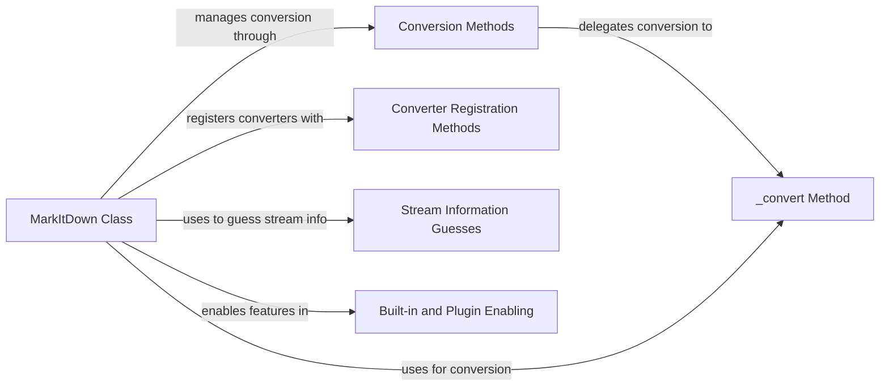

## Component Details

The MarkItDown component orchestrates the conversion of markdown text into various output formats. It initializes the conversion environment, enables built-in features and plugins, registers custom converters, and manages the conversion process from different input sources. The core of the conversion logic resides within the `_convert` method, which handles parsing, applying converters, and generating the final output. The component provides flexibility through converter registration and extensibility via plugins, making it adaptable to diverse conversion requirements.

### MarkItDown Class
The MarkItDown class serves as the central hub for markdown conversion. It manages the overall conversion process, including initialization, enabling features and plugins, registering converters, and delegating the actual conversion to the `_convert` method. It provides a high-level interface for converting markdown from various sources.
- **Related Classes/Methods**: `markitdown.packages.markitdown.src.markitdown._markitdown.MarkItDown` (93:771), `markitdown.packages.markitdown.src.markitdown._markitdown.MarkItDown:__init__` (97:130), `markitdown.packages.markitdown.src.markitdown._markitdown.MarkItDown:enable_builtins` (132:221), `markitdown.packages.markitdown.src.markitdown._markitdown.MarkItDown:enable_plugins` (223:241), `markitdown.packages.markitdown.src.markitdown._markitdown.MarkItDown:convert` (243:291), `markitdown.packages.markitdown.src.markitdown._markitdown.MarkItDown:convert_local` (293:328), `markitdown.packages.markitdown.src.markitdown._markitdown.MarkItDown:convert_stream` (330:375), `markitdown.packages.markitdown.src.markitdown._markitdown.MarkItDown:register_page_converter` (621:627), `markitdown.packages.markitdown.src.markitdown._markitdown.MarkItDown:register_converter` (629:659)

### Conversion Methods
These methods (`convert`, `convert_local`, `convert_stream`, `convert_url`, `convert_uri`, `convert_response`) act as entry points for converting markdown from various sources. They receive the input and delegate the actual conversion process to the internal `_convert` method, providing a consistent interface for different input types.
- **Related Classes/Methods**: `markitdown.packages.markitdown.src.markitdown._markitdown.MarkItDown:convert` (243:291), `markitdown.packages.markitdown.src.markitdown._markitdown.MarkItDown:convert_local` (293:328), `markitdown.packages.markitdown.src.markitdown._markitdown.MarkItDown:convert_stream` (330:375), `markitdown.packages.markitdown.src.markitdown._markitdown.MarkItDown:convert_url` (377:394), `markitdown.packages.markitdown.src.markitdown._markitdown.MarkItDown:convert_uri` (396:455), `markitdown.packages.markitdown.src.markitdown._markitdown.MarkItDown:convert_response` (457:527)

### _convert Method
The `_convert` method is the core logic of the markdown conversion process. It handles parsing the markdown input, applying registered converters and plugins, and generating the output in the desired format. It's the central processing unit where the actual transformation of markdown occurs.
- **Related Classes/Methods**: `markitdown.packages.markitdown.src.markitdown._markitdown.MarkItDown:_convert` (529:619)

### Converter Registration Methods
These methods (`register_page_converter`, `register_converter`) provide a mechanism for users to extend the functionality of the MarkItDown class by registering custom converters. This allows for tailoring the conversion process to specific needs and supporting different output formats.
- **Related Classes/Methods**: `markitdown.packages.markitdown.src.markitdown._markitdown.MarkItDown:register_page_converter` (621:627), `markitdown.packages.markitdown.src.markitdown._markitdown.MarkItDown:register_converter` (629:659)

### Stream Information Guesses
The `_get_stream_info_guesses` method is responsible for inferring the encoding and other relevant information from a stream of data. This is crucial for correctly processing input from various sources, ensuring that the markdown is interpreted accurately.
- **Related Classes/Methods**: `markitdown.packages.markitdown.src.markitdown._markitdown.MarkItDown:_get_stream_info_guesses` (661:760)

### Built-in and Plugin Enabling
The `enable_builtins` and `enable_plugins` methods configure the MarkItDown converter by activating default functionalities and external extensions. This allows the converter to support a wide range of features and adapt to different conversion scenarios.
- **Related Classes/Methods**: `markitdown.packages.markitdown.src.markitdown._markitdown.MarkItDown:enable_builtins` (132:221), `markitdown.packages.markitdown.src.markitdown._markitdown.MarkItDown:enable_plugins` (223:241)