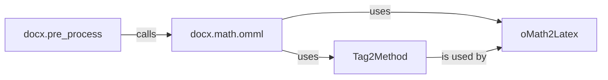

## Component Details

The DOCX Preprocessor component focuses on enhancing the accuracy of DOCX to Markdown conversions by specifically addressing mathematical equations. It identifies and converts equations from the OMML format to LaTeX, ensuring accurate representation in the final output. The preprocessing involves parsing the DOCX content, locating OMML equations, transforming them into LaTeX, and replacing the original equations within the document. This prepares the DOCX content for subsequent conversion steps, improving the overall quality of the Markdown output.

### docx.pre_process
This module serves as the entry point for DOCX preprocessing, orchestrating the identification and conversion of mathematical equations within the document. It calls functions to locate OMML equations, convert them to LaTeX format using the `docx.math.omml` module, and replace the original equations within the DOCX content. It manages the overall flow of the preprocessing pipeline.
- **Related Classes/Methods**: `markitdown.packages.markitdown.src.markitdown.converter_utils.docx.pre_process:pre_process_docx` (118:156), `markitdown.packages.markitdown.src.markitdown.converter_utils.docx.pre_process:_convert_omath_to_latex` (33:49), `markitdown.packages.markitdown.src.markitdown.converter_utils.docx.pre_process:_get_omath_tag_replacement` (52:71), `markitdown.packages.markitdown.src.markitdown.converter_utils.docx.pre_process:_replace_equations` (74:96), `markitdown.packages.markitdown.src.markitdown.converter_utils.docx.pre_process:_pre_process_math` (99:115)

### docx.math.omml
This module is responsible for parsing and converting OMML equations into LaTeX format. It provides functions to load OMML data from strings or files, parse the XML structure, and generate the corresponding LaTeX code. It utilizes the `oMath2Latex` class to handle the conversion of individual OMML elements and `Tag2Method` to process XML tags.
- **Related Classes/Methods**: `markitdown.packages.markitdown.src.markitdown.converter_utils.docx.math.omml:load` (43:46), `markitdown.packages.markitdown.src.markitdown.converter_utils.docx.math.omml:load_string` (49:52), `markitdown.packages.markitdown.src.markitdown.converter_utils.docx.math.omml.Tag2Method:process_children_list` (86:101), `markitdown.packages.markitdown.src.markitdown.converter_utils.docx.math.omml.Tag2Method:process_children_dict` (103:110), `markitdown.packages.markitdown.src.markitdown.converter_utils.docx.math.omml.Tag2Method:process_children` (112:121), `markitdown.packages.markitdown.src.markitdown.converter_utils.docx.math.omml.Pr:__init__` (136:138), `markitdown.packages.markitdown.src.markitdown.converter_utils.docx.math.omml.Pr:__unicode__` (143:144)

### oMath2Latex
The `oMath2Latex` class is the core component for converting individual OMML elements into their LaTeX equivalents. It provides methods to handle various OMML tags, generating the corresponding LaTeX representation for each. It is instantiated and used by the `docx.math.omml` module to perform the actual conversion of OMML equations.
- **Related Classes/Methods**: `markitdown.packages.markitdown.src.markitdown.converter_utils.docx.math.omml.oMath2Latex:__init__` (179:180), `markitdown.packages.markitdown.src.markitdown.converter_utils.docx.math.omml.oMath2Latex:__unicode__` (185:186), `markitdown.packages.markitdown.src.markitdown.converter_utils.docx.math.omml.oMath2Latex:process_unknow` (188:194), `markitdown.packages.markitdown.src.markitdown.converter_utils.docx.math.omml.oMath2Latex:do_acc` (200:208), `markitdown.packages.markitdown.src.markitdown.converter_utils.docx.math.omml.oMath2Latex:do_bar` (210:217), `markitdown.packages.markitdown.src.markitdown.converter_utils.docx.math.omml.oMath2Latex:do_d` (219:232), `markitdown.packages.markitdown.src.markitdown.converter_utils.docx.math.omml.oMath2Latex:do_sub` (240:242), `markitdown.packages.markitdown.src.markitdown.converter_utils.docx.math.omml.oMath2Latex:do_sup` (244:246), `markitdown.packages.markitdown.src.markitdown.converter_utils.docx.math.omml.oMath2Latex:do_f` (248:255), `markitdown.packages.markitdown.src.markitdown.converter_utils.docx.math.omml.oMath2Latex:do_func` (257:263), `markitdown.packages.markitdown.src.markitdown.converter_utils.docx.math.omml.oMath2Latex:do_fname` (265:279), `markitdown.packages.markitdown.src.markitdown.converter_utils.docx.math.omml.oMath2Latex:do_groupchr` (281:288), `markitdown.packages.markitdown.src.markitdown.converter_utils.docx.math.omml.oMath2Latex:do_rad` (290:300), `markitdown.packages.markitdown.src.markitdown.converter_utils.docx.math.omml.oMath2Latex:do_eqarr` (302:310), `markitdown.packages.markitdown.src.markitdown.converter_utils.docx.math.omml.oMath2Latex:do_limlow` (312:321), `markitdown.packages.markitdown.src.markitdown.converter_utils.docx.math.omml.oMath2Latex:do_limupp` (323:328), `markitdown.packages.markitdown.src.markitdown.converter_utils.docx.math.omml.oMath2Latex:do_lim` (330:334), `markitdown.packages.markitdown.src.markitdown.converter_utils.docx.math.omml.oMath2Latex:do_m` (336:346), `markitdown.packages.markitdown.src.markitdown.converter_utils.docx.math.omml.oMath2Latex:do_mr` (348:354), `markitdown.packages.markitdown.src.markitdown.converter_utils.docx.math.omml.oMath2Latex:do_nary` (356:367), `markitdown.packages.markitdown.src.markitdown.converter_utils.docx.math.omml.oMath2Latex:do_r` (369:379)

### Tag2Method
The `Tag2Method` class is responsible for processing XML tags within the OMML structure. It dispatches the processing of different tag types to appropriate methods. It handles different types of children within the XML structure, processing them either as a list or a dictionary.
- **Related Classes/Methods**: `markitdown.packages.markitdown.src.markitdown.converter_utils.docx.math.omml.Tag2Method:process_children_list` (86:101), `markitdown.packages.markitdown.src.markitdown.converter_utils.docx.math.omml.Tag2Method:process_children_dict` (103:110), `markitdown.packages.markitdown.src.markitdown.converter_utils.docx.math.omml.Tag2Method:process_children` (112:121)