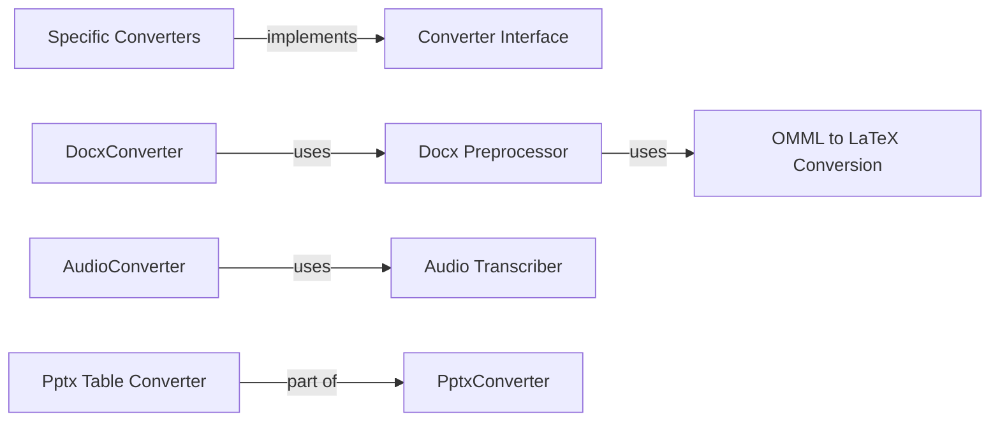

## Component Details

The Document Converters component provides a set of specialized converters, each responsible for transforming a specific document format into Markdown. These converters are managed by a central conversion manager and offer the core functionality for supporting a wide range of document types. The conversion process typically involves extracting the content from the input file, applying format-specific transformations, and generating the corresponding Markdown output.

### Converter Interface
This component defines the interface for all document converters. Each specific converter implements a `convert` method that takes an input file and converts it to markdown format. This interface provides a common way to interact with different types of converters, ensuring that all converters adhere to a consistent structure and functionality.
- **Related Classes/Methods**: `markitdown.packages.markitdown.src.markitdown.converters._pptx_converter.PptxConverter:convert` (61:188), `markitdown.packages.markitdown.src.markitdown.converters._csv_converter.CsvConverter:convert` (38:77), `markitdown.packages.markitdown.src.markitdown.converters._xlsx_converter.XlsxConverter:convert` (63:95), `markitdown.packages.markitdown.src.markitdown.converters._html_converter.HtmlConverter:convert` (41:71), `markitdown.packages.markitdown.src.markitdown.converters._docx_converter.DocxConverter:convert` (55:80), `markitdown.packages.markitdown.src.markitdown.converters._pdf_converter.PdfConverter:convert` (54:77), `markitdown.packages.markitdown.src.markitdown.converters._epub_converter.EpubConverter:convert` (53:130), `markitdown.packages.markitdown.src.markitdown.converters._plain_text_converter.PlainTextConverter:convert` (60:71), `markitdown.packages.markitdown.src.markitdown.converters._zip_converter.ZipConverter:convert` (87:116), `markitdown.packages.markitdown.src.markitdown.converters._image_converter.ImageConverter:convert` (39:85), `markitdown.packages.markitdown.src.markitdown.converters._outlook_msg_converter.OutlookMsgConverter:convert` (73:125), `markitdown.packages.markitdown.src.markitdown.converters._audio_converter.AudioConverter:convert` (46:101), `markitdown.packages.markitdown.src.markitdown.converters._ipynb_converter.IpynbConverter:convert` (46:55), `markitdown.packages.markitdown.src.markitdown.converters._bing_serp_converter.BingSerpConverter:convert` (57:120), `markitdown.packages.markitdown.src.markitdown.converters._youtube_converter.YouTubeConverter:convert` (70:197), `markitdown.packages.markitdown.src.markitdown.converters._doc_intel_converter.DocumentIntelligenceConverter:convert` (232:249), `markitdown.packages.markitdown.src.markitdown.converters._wikipedia_converter.WikipediaConverter:convert` (51:87), `markitdown.packages.markitdown.src.markitdown.converters._rss_converter.RssConverter:convert` (84:99), `markitdown.packages.markitdown-sample-plugin.src.markitdown_sample_plugin._plugin.RtfConverter:convert` (57:71)

### Docx Preprocessor
This component focuses on preprocessing Docx files, specifically handling and converting mathematical equations from OMML format to LaTeX. It includes functions for identifying, extracting, and replacing equations within the Docx content before the main conversion process, ensuring that mathematical content is accurately represented in the final Markdown output.
- **Related Classes/Methods**: `markitdown.packages.markitdown.src.markitdown.converter_utils.docx.pre_process:_convert_omath_to_latex` (33:49), `markitdown.packages.markitdown.src.markitdown.converter_utils.docx.pre_process:_get_omath_tag_replacement` (52:71), `markitdown.packages.markitdown.src.markitdown.converter_utils.docx.pre_process:_replace_equations` (74:96), `markitdown.packages.markitdown.src.markitdown.converter_utils.docx.pre_process:_pre_process_math` (99:115), `markitdown.packages.markitdown.src.markitdown.converter_utils.docx.pre_process:pre_process_docx` (118:156)

### OMML to LaTeX Conversion
This component is responsible for converting Office Math Markup Language (OMML) elements within a Docx file into LaTeX format. It involves loading OMML data, processing its tags, and generating corresponding LaTeX code. It uses Tag2Method and oMath2Latex classes to achieve the conversion, ensuring that complex mathematical expressions are accurately translated into a format suitable for Markdown representation.
- **Related Classes/Methods**: `markitdown.packages.markitdown.src.markitdown.converter_utils.docx.math.omml:load` (43:46), `markitdown.packages.markitdown.src.markitdown.converter_utils.docx.math.omml:load_string` (49:52), `markitdown.packages.markitdown.src.markitdown.converter_utils.docx.math.omml.Tag2Method:process_children_list` (86:101), `markitdown.packages.markitdown.src.markitdown.converter_utils.docx.math.omml.Tag2Method:process_children_dict` (103:110), `markitdown.packages.markitdown.src.markitdown.converter_utils.docx.math.omml.Tag2Method:process_children` (112:121), `markitdown.packages.markitdown.src.markitdown.converter_utils.docx.math.omml.Pr:__init__` (136:138), `markitdown.packages.markitdown.src.markitdown.converter_utils.docx.math.omml.Pr:__unicode__` (143:144), `markitdown.packages.markitdown.src.markitdown.converter_utils.docx.math.omml.oMath2Latex:__init__` (179:180), `markitdown.packages.markitdown.src.markitdown.converter_utils.docx.math.omml.oMath2Latex:__unicode__` (185:186), `markitdown.packages.markitdown.src.markitdown.converter_utils.docx.math.omml.oMath2Latex:process_unknow` (188:194), `markitdown.packages.markitdown.src.markitdown.converter_utils.docx.math.omml.oMath2Latex:do_acc` (200:208), `markitdown.packages.markitdown.src.markitdown.converter_utils.docx.math.omml.oMath2Latex:do_bar` (210:217), `markitdown.packages.markitdown.src.markitdown.converter_utils.docx.math.omml.oMath2Latex:do_d` (219:232), `markitdown.packages.markitdown.src.markitdown.converter_utils.docx.math.omml.oMath2Latex:do_sub` (240:242), `markitdown.packages.markitdown.src.markitdown.converter_utils.docx.math.omml.oMath2Latex:do_sup` (244:246), `markitdown.packages.markitdown.src.markitdown.converter_utils.docx.math.omml.oMath2Latex:do_f` (248:255), `markitdown.packages.markitdown.src.markitdown.converter_utils.docx.math.omml.oMath2Latex:do_func` (257:263), `markitdown.packages.markitdown.src.markitdown.converter_utils.docx.math.omml.oMath2Latex:do_fname` (265:279), `markitdown.packages.markitdown.src.markitdown.converter_utils.docx.math.omml.oMath2Latex:do_groupchr` (281:288), `markitdown.packages.markitdown.src.markitdown.converter_utils.docx.math.omml.oMath2Latex:do_rad` (290:300), `markitdown.packages.markitdown.src.markitdown.converter_utils.docx.math.omml.oMath2Latex:do_eqarr` (302:310), `markitdown.packages.markitdown.src.markitdown.converter_utils.docx.math.omml.oMath2Latex:do_limlow` (312:321), `markitdown.packages.markitdown.src.markitdown.converter_utils.docx.math.omml.oMath2Latex:do_limupp` (323:328), `markitdown.packages.markitdown.src.markitdown.converter_utils.docx.math.omml.oMath2Latex:do_lim` (330:334), `markitdown.packages.markitdown.src.markitdown.converter_utils.docx.math.omml.oMath2Latex:do_m` (336:346), `markitdown.packages.markitdown.src.markitdown.converter_utils.docx.math.omml.oMath2Latex:do_mr` (348:354), `markitdown.packages.markitdown.src.markitdown.converter_utils.docx.math.omml.oMath2Latex:do_nary` (356:367), `markitdown.packages.markitdown.src.markitdown.converter_utils.docx.math.omml.oMath2Latex:do_r` (369:379)

### Pptx Table Converter
This component focuses on converting tables within a PPTX file to markdown format. It is a sub-module of the PptxConverter and handles the specific logic required to extract table data and structure it appropriately in Markdown.
- **Related Classes/Methods**: `markitdown.packages.markitdown.src.markitdown.converters._pptx_converter.PptxConverter:_convert_table_to_markdown` (203:221)

### Audio Transcriber
This component is responsible for transcribing audio files into text. It likely uses a speech-to-text engine to perform the transcription, enabling the conversion of spoken content into a textual format that can be included in the Markdown output.
- **Related Classes/Methods**: `markitdown.packages.markitdown.src.markitdown.converters._transcribe_audio:transcribe_audio` (23:49)

### Specific Converters
This component represents the collection of concrete converter classes, each tailored to handle a specific document format. These converters implement the `Converter Interface` and provide the format-specific logic for extracting content and transforming it into Markdown. Examples include `PptxConverter`, `CsvConverter`, `XlsxConverter`, `HtmlConverter`, `DocxConverter`, and `PdfConverter`.
- **Related Classes/Methods**: `markitdown.packages.markitdown.src.markitdown.converters._pptx_converter.PptxConverter` (34:252), `markitdown.packages.markitdown.src.markitdown.converters._csv_converter.CsvConverter` (15:77), `markitdown.packages.markitdown.src.markitdown.converters._xlsx_converter.XlsxConverter` (36:95), `markitdown.packages.markitdown.src.markitdown.converters._docx_converter.DocxConverter` (28:80), `markitdown.packages.markitdown.src.markitdown.converters._html_converter.HtmlConverter` (20:90), `markitdown.packages.markitdown.src.markitdown.converters._pdf_converter.PdfConverter` (31:77), `markitdown.packages.markitdown.src.markitdown.converters._epub_converter.EpubConverter` (26:146), `markitdown.packages.markitdown.src.markitdown.converters._plain_text_converter.PlainTextConverter` (33:71), `markitdown.packages.markitdown.src.markitdown.converters._zip_converter.ZipConverter` (22:116), `markitdown.packages.markitdown.src.markitdown.converters._image_converter.ImageConverter` (16:138), `markitdown.packages.markitdown.src.markitdown.converters._outlook_msg_converter.OutlookMsgConverter` (24:149), `markitdown.packages.markitdown.src.markitdown.converters._audio_converter.AudioConverter` (23:101), `markitdown.packages.markitdown.src.markitdown.converters._ipynb_converter.IpynbConverter` (15:96), `markitdown.packages.markitdown.src.markitdown.converters._bing_serp_converter.BingSerpConverter` (23:120), `markitdown.packages.markitdown.src.markitdown.converters._youtube_converter.YouTubeConverter` (37:238), `markitdown.packages.markitdown.src.markitdown.converters._doc_intel_converter.DocumentIntelligenceConverter` (125:249), `markitdown.packages.markitdown.src.markitdown.converters._wikipedia_converter.WikipediaConverter` (20:87), `markitdown.packages.markitdown.src.markitdown.converters._rss_converter.RssConverter` (29:192), `markitdown.packages.markitdown-sample-plugin.src.markitdown_sample_plugin._plugin.RtfConverter` (34:71)