```mermaid
graph LR
    docx_pre_process["docx.pre_process"]
    docx_math_omml["docx.math.omml"]
    oMath2Latex["oMath2Latex"]
    Tag2Method["Tag2Method"]
    docx_pre_process -- "calls" --> docx_math_omml
    docx_pre_process -- "calls" --> oMath2Latex
    markitdown_packages_markitdown_src_markitdown_converter_utils_docx_pre_process__replace_equations -- "calls" --> markitdown_packages_markitdown_src_markitdown_converter_utils_docx_pre_process__convert_omath_to_latex
    markitdown_packages_markitdown_src_markitdown_converter_utils_docx_pre_process__pre_process_math -- "calls" --> markitdown_packages_markitdown_src_markitdown_converter_utils_docx_pre_process__replace_equations
    markitdown_packages_markitdown_src_markitdown_converter_utils_docx_pre_process_pre_process_docx -- "calls" --> markitdown_packages_markitdown_src_markitdown_converter_utils_docx_pre_process__pre_process_math
    Tag2Method -- "calls" --> markitdown_packages_markitdown_src_markitdown_converter_utils_docx_math_omml_Tag2Method_process_children_list
    Tag2Method -- "calls" --> markitdown_packages_markitdown_src_markitdown_converter_utils_docx_math_omml_Tag2Method_process_children_dict
    oMath2Latex -- "uses" --> docx_math_omml
    Tag2Method -- "delegates to" --> oMath2Latex
```

## Component Details

The DOCX Preprocessor subsystem focuses on converting mathematical equations within DOCX files into LaTeX format, enabling their accurate representation in Markdown. The process involves identifying OMML (Office Math Markup Language) elements, parsing them, converting them to LaTeX code, and replacing the original OMML with the generated LaTeX within the DOCX content. This ensures that mathematical equations are correctly rendered when the DOCX file is converted to Markdown.

### docx.pre_process
This module orchestrates the preprocessing of DOCX files, specifically targeting mathematical equations. It identifies, converts, and replaces equations within the DOCX content, preparing it for conversion to Markdown. It calls the `_convert_omath_to_latex` function to convert OMML equations to LaTeX and integrates the LaTeX code back into the document.
- **Related Classes/Methods**: `markitdown.packages.markitdown.src.markitdown.converter_utils.docx.pre_process:_convert_omath_to_latex` (33:49), `markitdown.packages.markitdown.src.markitdown.converter_utils.docx.pre_process:_get_omath_tag_replacement` (52:71), `markitdown.packages.markitdown.src.markitdown.converter_utils.docx.pre_process:_replace_equations` (74:96), `markitdown.packages.markitdown.src.markitdown.converter_utils.docx.pre_process:_pre_process_math` (99:115), `markitdown.packages.markitdown.src.markitdown.converter_utils.docx.pre_process:pre_process_docx` (118:156)

### docx.math.omml
This module handles the representation and processing of Office Math Markup Language (OMML) elements within DOCX files. It provides functionalities to load, parse, and convert OMML structures into LaTeX format. It defines classes and methods for parsing OMML tags and converting them into LaTeX representations.
- **Related Classes/Methods**: `markitdown.packages.markitdown.src.markitdown.converter_utils.docx.math.omml:load` (43:46), `markitdown.packages.markitdown.src.markitdown.converter_utils.docx.math.omml:load_string` (49:52)

### oMath2Latex
The `oMath2Latex` class is responsible for converting OMML (Office Math Markup Language) elements into LaTeX code. It provides methods to handle various OMML tags and generate the corresponding LaTeX representation for mathematical symbols and structures. It interacts with the `docx.math.omml` module to parse OMML elements and produces LaTeX output.
- **Related Classes/Methods**: `markitdown.packages.markitdown.src.markitdown.converter_utils.docx.math.omml.oMath2Latex:__init__` (179:180), `markitdown.packages.markitdown.src.markitdown.converter_utils.docx.math.omml.oMath2Latex:__unicode__` (185:186), `markitdown.packages.markitdown.src.markitdown.converter_utils.docx.math.omml.oMath2Latex:process_unknow` (188:194), `markitdown.packages.markitdown.src.markitdown.converter_utils.docx.math.omml.oMath2Latex:do_acc` (200:208), `markitdown.packages.markitdown.src.markitdown.converter_utils.docx.math.omml.oMath2Latex:do_bar` (210:217), `markitdown.packages.markitdown.src.markitdown.converter_utils.docx.math.omml.oMath2Latex:do_d` (219:232), `markitdown.packages.markitdown.src.markitdown.converter_utils.docx.math.omml.oMath2Latex:do_sub` (240:242), `markitdown.packages.markitdown.src.markitdown.converter_utils.docx.math.omml.oMath2Latex:do_sup` (244:246), `markitdown.packages.markitdown.src.markitdown.converter_utils.docx.math.omml.oMath2Latex:do_f` (248:255), `markitdown.packages.markitdown.src.markitdown.converter_utils.docx.math.omml.oMath2Latex:do_func` (257:263), `markitdown.packages.markitdown.src.markitdown.converter_utils.docx.math.omml.oMath2Latex:do_fname` (265:279), `markitdown.packages.markitdown.src.markitdown.converter_utils.docx.math.omml.oMath2Latex:do_groupchr` (281:288), `markitdown.packages.markitdown.src.markitdown.converter_utils.docx.math.omml.oMath2Latex:do_rad` (290:300), `markitdown.packages.markitdown.src.markitdown.converter_utils.docx.math.omml.oMath2Latex:do_eqarr` (302:310), `markitdown.packages.markitdown.src.markitdown.converter_utils.docx.math.omml.oMath2Latex:do_limlow` (312:321), `markitdown.packages.markitdown.src.markitdown.converter_utils.docx.math.omml.oMath2Latex:do_limupp` (323:328), `markitdown.packages.markitdown.src.markitdown.converter_utils.docx.math.omml.oMath2Latex:do_lim` (330:334), `markitdown.packages.markitdown.src.markitdown.converter_utils.docx.math.omml.oMath2Latex:do_m` (336:346), `markitdown.packages.markitdown.src.markitdown.converter_utils.docx.math.omml.oMath2Latex:do_mr` (348:354), `markitdown.packages.markitdown.src.markitdown.converter_utils.docx.math.omml.oMath2Latex:do_nary` (356:367), `markitdown.packages.markitdown.src.markitdown.converter_utils.docx.math.omml.oMath2Latex:do_r` (369:379)

### Tag2Method
The `Tag2Method` class is responsible for processing OMML tags and delegating the conversion to LaTeX to the appropriate methods within the `oMath2Latex` class. It provides methods for processing children elements within OMML tags, either as a list or a dictionary. It acts as a dispatcher, directing the conversion process based on the specific OMML tag encountered.
- **Related Classes/Methods**: `markitdown.packages.markitdown.src.markitdown.converter_utils.docx.math.omml.Tag2Method:process_children_list` (86:101), `markitdown.packages.markitdown.src.markitdown.converter_utils.docx.math.omml.Tag2Method:process_children_dict` (103:110), `markitdown.packages.markitdown.src.markitdown.converter_utils.docx.math.omml.Tag2Method:process_children` (112:121)