```mermaid
graph LR
    Core_Conversion_Manager["Core Conversion Manager"]
    Document_Converters["Document Converters"]
    DOCX_Preprocessor["DOCX Preprocessor"]
    OMML_to_LaTeX_Converter["OMML to LaTeX Converter"]
    Plugin_Manager["Plugin Manager"]
    Application_Entrypoint["Application Entrypoint"]
    Core_Conversion_Manager -- "manages" --> Document_Converters
    Document_Converters -- "preprocess" --> DOCX_Preprocessor
    DOCX_Preprocessor -- "converts math" --> OMML_to_LaTeX_Converter
    Core_Conversion_Manager -- "registers" --> Plugin_Manager
    Application_Entrypoint -- "initializes" --> Core_Conversion_Manager
    click Core_Conversion_Manager href "https://github.com/CodeBoarding/GeneratedOnBoardings/blob/main/markitdown/Core Conversion Manager.md" "Details"
    click Document_Converters href "https://github.com/CodeBoarding/GeneratedOnBoardings/blob/main/markitdown/Document Converters.md" "Details"
    click DOCX_Preprocessor href "https://github.com/CodeBoarding/GeneratedOnBoardings/blob/main/markitdown/DOCX Preprocessor.md" "Details"
    click OMML_to_LaTeX_Converter href "https://github.com/CodeBoarding/GeneratedOnBoardings/blob/main/markitdown/OMML to LaTeX Converter.md" "Details"
    click Plugin_Manager href "https://github.com/CodeBoarding/GeneratedOnBoardings/blob/main/markitdown/Plugin Manager.md" "Details"
    click Application_Entrypoint href "https://github.com/CodeBoarding/GeneratedOnBoardings/blob/main/markitdown/Application Entrypoint.md" "Details"
```

## Component Details

The MarkItDown application converts various document formats into Markdown. The core flow involves the Application Entrypoint initializing the Core Conversion Manager, which then orchestrates the conversion process. The Core Conversion Manager utilizes Document Converters for specific file formats, and these converters may employ preprocessors like the DOCX Preprocessor. The DOCX Preprocessor uses the OMML to LaTeX Converter for handling mathematical equations. The Core Conversion Manager also supports extending the application's capabilities through the Plugin Manager, allowing for the integration of custom converters.

### Core Conversion Manager
This component is the central orchestrator of the conversion process. It manages the registration, enabling, and selection of appropriate document converters based on the input file type. It handles various input sources, including local files, streams, URLs, and responses, and directs them to the corresponding converter. It also manages stream information and supports plugin converters, providing a flexible and extensible conversion pipeline.
- **Related Classes/Methods**: `markitdown.packages.markitdown.src.markitdown._markitdown.MarkItDown:__init__` (97:130), `markitdown.packages.markitdown.src.markitdown._markitdown.MarkItDown:enable_builtins` (132:221), `markitdown.packages.markitdown.src.markitdown._markitdown.MarkItDown:enable_plugins` (223:241), `markitdown.packages.markitdown.src.markitdown._markitdown.MarkItDown:convert` (243:291), `markitdown.packages.markitdown.src.markitdown._markitdown.MarkItDown:convert_local` (293:328), `markitdown.packages.markitdown.src.markitdown._markitdown.MarkItDown:convert_stream` (330:375), `markitdown.packages.markitdown.src.markitdown._markitdown.MarkItDown:register_page_converter` (621:627), `markitdown.packages.markitdown.src.markitdown._markitdown.MarkItDown:register_converter` (629:659)

### Document Converters
This component is a collection of specialized converters, each designed to handle a specific document format. These converters extract content from their respective formats and transform it into Markdown. They are managed by the Core Conversion Manager and provide the core functionality for supporting a wide range of document types.
- **Related Classes/Methods**: `markitdown.packages.markitdown.src.markitdown.converters._pptx_converter.PptxConverter:convert` (61:188), `markitdown.packages.markitdown.src.markitdown.converters._csv_converter.CsvConverter:convert` (38:77), `markitdown.packages.markitdown.src.markitdown.converters._xlsx_converter.XlsxConverter:convert` (63:95), `markitdown.packages.markitdown.src.markitdown.converters._docx_converter.DocxConverter:convert` (55:80), `markitdown.packages.markitdown.src.markitdown.converters._html_converter.HtmlConverter:convert` (41:71), `markitdown.packages.markitdown.src.markitdown.converters._pdf_converter.PdfConverter:convert` (54:77)

### DOCX Preprocessor
This component focuses on preprocessing DOCX files to improve the accuracy of the conversion. Its primary function is to identify and convert mathematical equations from OMML to LaTeX format, ensuring that equations are accurately represented in the final Markdown output. It prepares the DOCX content for the standard DOCX converter by handling the math equations.
- **Related Classes/Methods**: `markitdown.packages.markitdown.src.markitdown.converter_utils.docx.pre_process:pre_process_docx` (118:156), `markitdown.packages.markitdown.src.markitdown.converter_utils.docx.pre_process:_convert_omath_to_latex` (33:49)

### OMML to LaTeX Converter
This component is a sub-component of the DOCX Preprocessor, dedicated to converting individual OMML (Office Math Markup Language) elements into LaTeX code. It parses OMML tags and generates the corresponding LaTeX representation for mathematical symbols and structures, enabling accurate rendering of equations in Markdown.
- **Related Classes/Methods**: `markitdown.packages.markitdown.src.markitdown.converter_utils.docx.math.omml.oMath2Latex:do_acc` (200:208), `markitdown.packages.markitdown.src.markitdown.converter_utils.docx.math.omml.oMath2Latex:do_bar` (210:217), `markitdown.packages.markitdown.src.markitdown.converter_utils.docx.math.omml.oMath2Latex:do_d` (219:232)

### Plugin Manager
This component manages the registration and enabling of external plugins, allowing the MarkItDown application to be extended with custom converters. It provides a mechanism for incorporating converters defined in separate packages, enhancing the application's format support and adaptability.
- **Related Classes/Methods**: `markitdown.packages.markitdown-sample-plugin.src.markitdown_sample_plugin._plugin:register_converters` (25:31)

### Application Entrypoint
This component serves as the main entry point for the MarkItDown application. It handles command-line arguments, initializes the Core Conversion Manager, and initiates the conversion process based on user input. It orchestrates the overall application flow, setting up the environment and triggering the conversion pipeline.
- **Related Classes/Methods**: `markitdown.packages.markitdown.src.markitdown.__main__:main` (13:200)