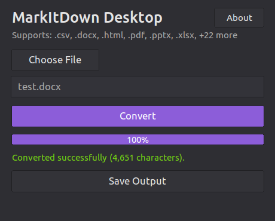
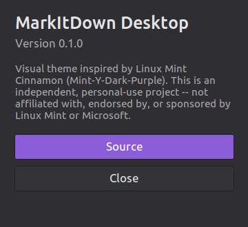

# MarkItDown Desktop

A small desktop app for converting files to Markdown, styled to match Linux Mint's Cinnamon
desktop. Pick a file, click Convert, save the result — no command line required.

<p align="center">
  <a href="https://github.com/Ayush-Chaugule/gui-markitdown/releases">
    
  </a>
</p>

MarkItDown Desktop is a graphical front end for [MarkItDown](https://github.com/microsoft/markitdown),
Microsoft's command-line/Python tool for converting documents, spreadsheets, presentations, images,
audio, and more into clean Markdown. This project wraps that library in a Tkinter GUI so it can be
used without touching a terminal, and packages it as a standalone executable so it can be run
without installing Python or any dependencies.

## Screenshots

| Main window | About |
| --- | --- |
|  |  |

The visual theme is inspired by Linux Mint's Cinnamon desktop (the Mint-Y-Dark-Purple variant) —
colors, fonts, and button styling are drawn from that theme so the app feels at home there.

## Getting it

The recommended way to get MarkItDown Desktop is to grab the latest build from the
[**Releases**](https://github.com/Ayush-Chaugule/gui-markitdown/releases) page: download the Linux
build, extract it if it's a zip, and run `./run.sh` (or the `markitdown-gui` executable directly).
Nothing else to install — Python and its runtime are bundled into the executable.

If no release has been published yet, or you'd rather run from source, clone the repo and run the
same launcher script — it bootstraps everything it needs automatically on first run:

```bash
git clone https://github.com/Ayush-Chaugule/gui-markitdown.git
cd gui-markitdown
./run.sh
```

The first run sets up a local, self-contained environment and installs what it needs (silently,
one time only); every run after that starts immediately. This still doesn't require you to run
`pip install` or manage a virtual environment yourself.

### Building the standalone executable yourself

```bash
packages/markitdown-gui/packaging/build_linux.sh
```

This produces a single-file Linux executable at `packages/markitdown-gui/packaging/dist/markitdown-gui`
using PyInstaller, with the same Python installed by `run.sh` and no extra steps. See
`packages/markitdown-gui/README.md` for more on the package layout.

## Supported formats

The list below is generated directly from the converters MarkItDown actually registers, not
maintained by hand — the app builds its own "Supports: ..." label the same way, so this list
never drifts out of sync with what the app can really convert.

| Category | Extensions |
| --- | --- |
| Documents | `.docx` `.pdf` `.epub` `.msg` (Outlook) |
| Spreadsheets | `.xlsx` `.xls` `.csv` |
| Presentations | `.pptx` |
| Images | `.jpg` `.jpeg` `.png` |
| Audio | `.wav` `.mp3` `.mp4` `.m4a` |
| Web & markup | `.html` `.htm` `.xml` `.rss` `.atom` |
| Text & data | `.txt` `.text` `.md` `.markdown` `.json` `.jsonl` |
| Notebooks | `.ipynb` |
| Archives | `.zip` (converts each file inside) |

Audio transcription and image EXIF metadata extraction rely on `ffmpeg` and `exiftool` being
present on the system; if they aren't, those specific features degrade gracefully rather than
failing the whole conversion.

## What's in this repository

This is a fork of [microsoft/markitdown](https://github.com/microsoft/markitdown) that adds a
desktop GUI on top of the original library:

- [`packages/markitdown/`](packages/markitdown) — the original MarkItDown library and CLI, unmodified.
- [`packages/markitdown-gui/`](packages/markitdown-gui) — **this project's addition**: the Tkinter
  desktop application described above.
- [`run.sh`](run.sh) — the launcher end users run; see [Getting it](#getting-it) above.

For the underlying library's own documentation (Python API, CLI usage, Azure integrations, plugin
system), see [`packages/markitdown/README.md`](packages/markitdown/README.md) or the
[upstream project](https://github.com/microsoft/markitdown).

## License

MIT — see [`LICENSE`](LICENSE). The original MarkItDown library is Copyright (c) Microsoft
Corporation. The GUI added in this fork is Copyright (c) Ayush Chaugule, released under the same
license.

This is an independent personal project. It is not affiliated with, endorsed by, or sponsored by
Microsoft or Linux Mint. Any use of Microsoft trademarks or logos is subject to
[Microsoft's Trademark & Brand Guidelines](https://www.microsoft.com/en-us/legal/intellectualproperty/trademarks/usage/general);
the Linux Mint name and Cinnamon theme referenced here belong to their respective owners and are
credited only as the visual inspiration for this app's styling.
