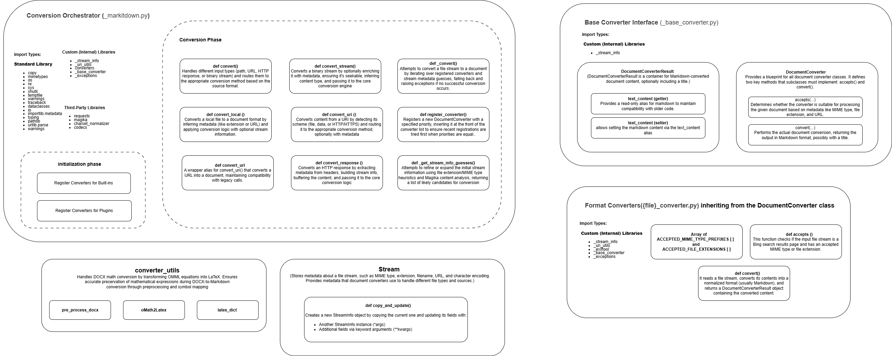

# MarkItDown CLI - Architecture Documentation

## Overview
This directory contains **C4 model architecture diagrams** for **MarkItDown**, a lightweight Python CLI tool that converts various document formats into clean, structured Markdown — optimized for use with **Large Language Models (LLMs)** and text analysis pipelines.

MarkItDown emphasizes **structural fidelity** (headings, lists, tables, links) and **machine readability**, making it ideal for preprocessing documents for AI workflows. While output is often human-readable, the focus is on **semantic accuracy** over visual presentation.

## 📊 C4 Architecture Diagrams

### Level 1: System Context Diagram


Shows how **users** interact with the **MarkItDown CLI** to convert files into Markdown


### Level 2: Container Diagram


Highlights the high-level components:
- **Main Module** (`__main__.py`) – CLI entry point and argument handling
- **MarkItDown Core** (`_markitdown.py`) – Orchestrates conversion logic
- **Document Converters** – Format-specific modules (PDF, DOCX, HTML, etc.)
- **Utilities** – Stream handling, math preprocessing, exception management

All components work together to support **stream-based**, **plugin-extensible** conversion.

### Level 3: Component Diagram


Detailed view of internal structure:
- **Conversion Orchestrator**: Manages workflow: input → detection → conversion → output
- **Base Converter Interface**: Defines `accepts()` and `convert()` contract
- **Format Converters**: Built-in and pluggable converters per file type
- **StreamInfo**: Metadata (mimetype, extension, encoding) for smart routing
- **Error Handling**: Structured exceptions with retry context

Key Features:
- Plugin-based extensibility via `register_converter()`
- Streaming support for large files
- Automatic format detection
- Rich metadata and error tracking

### Level 4: Code-Level Diagram


Shows low-level design and relationships:
- **CLI Flow**: Argument parsing → output handling → error exit
- **Converter Inheritance**: All converters implement `DocumentConverter`
- **Exception Hierarchy**: `MarkItDownException` base with typed subclasses
- **Converter Registry**: Central registry of available converters by format
- **Math Processing**: DOCX equation (OMML) → LaTeX → Markdown

This level supports maintainers and contributors in understanding control flow and extension points.

## 🗂️ Directory Structure
```
C4-Diagrams
  |-src (Editable source files)
  |-exports (Generated PNGs)
```
## 📌 Purpose
These diagrams improve:
- Onboarding new contributors
- Long-term maintainability
- Design discussions and refactoring
- Understanding of conversion pipeline and extensibility model